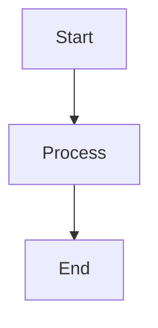

# Code Blocks Fixture

## JavaScript

```javascript
const greeting = 'Hello, World!';
console.log(greeting);
```

## Python

```python
def factorial(n):
    if n <= 1:
        return 1
    return n * factorial(n - 1)

print(factorial(5))
```

## Mermaid Diagram (Should Degrade)



## Unknown Language

```unknownlang
this should fallback to plain text
with multiple lines
```

## Inline Code

Use `npm install` to install dependencies, then run `npm start`.
